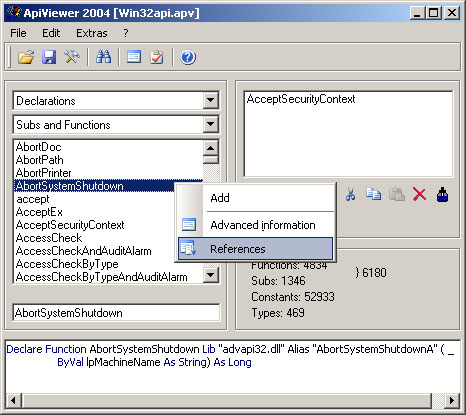

<div align="center">

## ApiViewer


</div>

### Description

Powerful API viewer to replace apiloader you used till now.
 
### More Info
 


<span>             |<span>
---                |---
**Submitted On**   |
**By**             |[Lefteris Eleftheriades](https://github.com/Planet-Source-Code/PSCIndex/blob/master/ByAuthor/lefteris-eleftheriades.md)
**Level**          |Advanced
**User Rating**    |5.0 (15 globes from 3 users)
**Compatibility**  |VB 4\.0 \(32\-bit\), VB 5\.0, VB 6\.0, VBA MS Access, VBA MS Excel
**Category**       |[Complete Applications](https://github.com/Planet-Source-Code/PSCIndex/blob/master/ByCategory/complete-applications__1-27.md)
**World**          |[Visual Basic](https://github.com/Planet-Source-Code/PSCIndex/blob/master/ByWorld/visual-basic.md)
**Archive File**   |[](https://github.com/Planet-Source-Code/lefteris-eleftheriades-apiviewer__1-58435/archive/master.zip)


### Source Code

```
Get API Viewer 2004 by Christoph von Wittich, free from this site:
http://www.activevb.de/rubriken/apiviewer/index-apiviewereng.html
It contains an updated list of APIs.
How to use:
Run Api viewer 2004 and Open Win32api.apv
Choose whether you want functions, constants or types and find what you need from the list.
```

